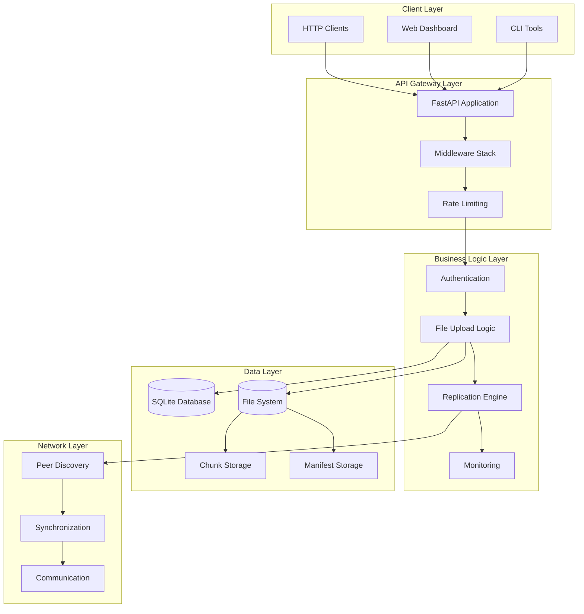
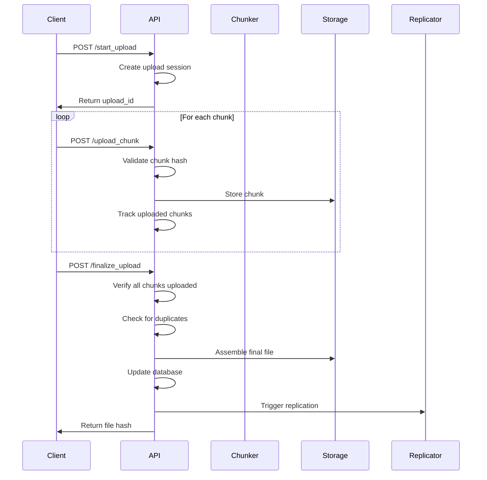
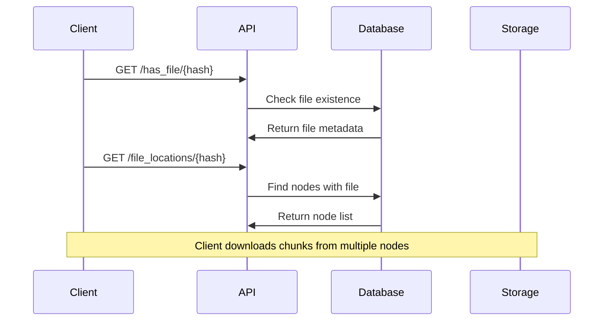
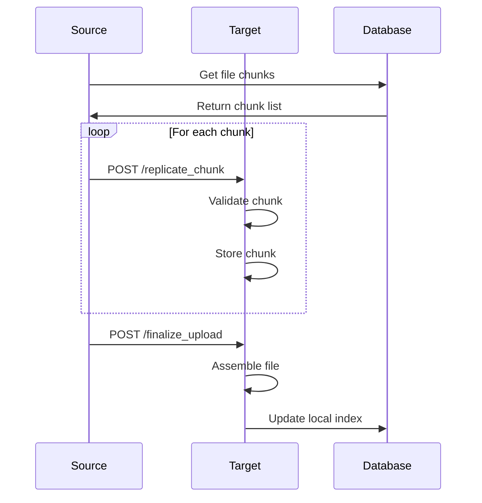
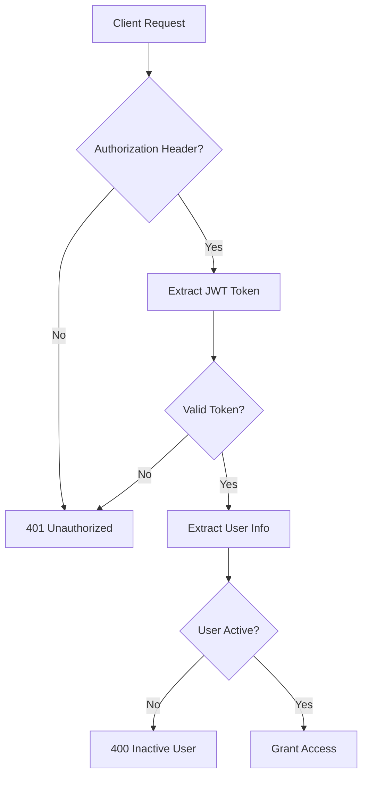

# 🏗️ Architecture Overview

This document provides a comprehensive overview of MeshCloud's architecture, design principles, and technical implementation.

## 📋 System Overview

MeshCloud is a distributed, peer-to-peer file storage and synchronization system designed for modern distributed computing environments. It provides a robust, secure, and scalable solution for file sharing across multiple nodes in a mesh network.

### Core Principles

- **🔄 Decentralized**: No single point of failure with peer-to-peer file distribution
- **🔒 Secure**: Enterprise-grade security with JWT authentication and rate limiting
- **📊 Observable**: Comprehensive monitoring and metrics collection
- **⚡ Performant**: Parallel chunked uploads with intelligent deduplication
- **🔍 Smart**: Automatic file deduplication and Merkle tree verification
- **🌐 RESTful**: Clean API design with OpenAPI specification

## 🏛️ High-Level Architecture



## 🧩 Component Architecture

### 1. API Layer (`app/main.py`)

The main FastAPI application that handles HTTP requests and responses.

**Responsibilities:**
- Route handling and request dispatching
- Response formatting and error handling
- Middleware integration
- Application lifecycle management

**Key Components:**
- FastAPI application instance
- CORS middleware
- Security middleware stack
- Rate limiting integration
- Metrics router inclusion

### 2. Authentication Layer (`app/auth.py`)

Handles user authentication and authorization.

**Responsibilities:**
- JWT token generation and validation
- Password hashing and verification
- User session management
- Node-to-node authentication

**Key Components:**
- JWT token handling
- Password security (bcrypt)
- User management
- Node token validation

### 3. Business Logic Layer

#### File Processing (`utils/`)
- **Chunker** (`utils/chunker.py`): Splits files into 4MB chunks
- **Hash** (`utils/hash.py`): SHA256 file and chunk hashing
- **Merkle** (`utils/merkle.py`): Merkle tree construction for integrity
- **Reassemble** (`utils/reassemble.py`): File reconstruction from chunks

#### Upload Logic (`app/main.py`)
- Upload session management
- Chunk validation and storage
- File finalization and deduplication
- Replication triggering

### 4. Data Layer (`app/db.py`)

SQLite-based data persistence with connection pooling.

**Database Schema:**
```sql
-- File metadata
CREATE TABLE files (
    hash TEXT PRIMARY KEY,
    filename TEXT NOT NULL,
    size INTEGER,
    uploaded_at TIMESTAMP DEFAULT CURRENT_TIMESTAMP,
    chunk_count INTEGER
);

-- File locations across nodes
CREATE TABLE file_index (
    file_hash TEXT,
    node TEXT,
    PRIMARY KEY (file_hash, node)
);

-- Upload sessions
CREATE TABLE upload_sessions (
    upload_id TEXT PRIMARY KEY,
    filename TEXT NOT NULL,
    total_chunks INTEGER NOT NULL,
    created_at TIMESTAMP DEFAULT CURRENT_TIMESTAMP
);

-- Uploaded chunks tracking
CREATE TABLE uploaded_chunks (
    upload_id TEXT,
    chunk_index INTEGER,
    chunk_hash TEXT,
    uploaded_at TIMESTAMP DEFAULT CURRENT_TIMESTAMP,
    PRIMARY KEY (upload_id, chunk_index)
);

-- File-chunk relationships
CREATE TABLE file_chunks (
    file_hash TEXT,
    chunk_hash TEXT,
    chunk_index INTEGER,
    PRIMARY KEY (file_hash, chunk_hash)
);

-- Synchronization queue
CREATE TABLE sync_queue (
    id INTEGER PRIMARY KEY AUTOINCREMENT,
    file_hash TEXT NOT NULL,
    peer TEXT NOT NULL,
    status TEXT DEFAULT 'pending',
    retry_count INTEGER DEFAULT 0,
    created_at TIMESTAMP DEFAULT CURRENT_TIMESTAMP
);

-- Peer status tracking
CREATE TABLE peer_status (
    peer TEXT PRIMARY KEY,
    online BOOLEAN DEFAULT 0,
    last_seen TIMESTAMP DEFAULT CURRENT_TIMESTAMP
);
```

### 5. Storage Layer

**Directory Structure:**
```
storage/
├── chunks/          # Individual file chunks
├── manifests/       # Upload session manifests
├── tmp/            # Temporary files during upload
└── files/          # Final assembled files (by hash)
```

**Chunk Storage:**
- 4MB chunks stored individually
- SHA256 hash-based naming
- Deduplication at chunk level
- Efficient for replication

### 6. Replication Layer

**Peer Discovery:**
- UDP broadcast for local network discovery
- Configurable peer lists
- Automatic peer health monitoring

**Synchronization Logic:**
- Chunk-level replication (BitTorrent-style)
- Parallel chunk transfers
- Failure retry mechanisms
- Bandwidth-aware scheduling

### 7. Monitoring Layer (`app/metrics.py`)

**Metrics Collection:**
- System metrics (CPU, memory, disk)
- Application metrics (requests, errors, performance)
- File operation statistics
- Replication success/failure rates

**Health Checks:**
- Automated health assessment
- Configurable thresholds
- Prometheus-compatible output
- Real-time status monitoring

## 🔄 Data Flow Architecture

### File Upload Flow



### File Retrieval Flow



### Replication Flow



## 🛡️ Security Architecture

### Authentication Flow



### Rate Limiting

- **Global Limit**: 100 requests/minute per client
- **Sliding Window**: Prevents burst attacks
- **Configurable**: Environment-based configuration
- **Graceful Degradation**: Proper error responses

### Input Validation

- **File Size Limits**: 100MB default, configurable
- **Filename Sanitization**: Path traversal prevention
- **Content-Type Validation**: Binary data verification
- **Hash Verification**: SHA256 integrity checks

## 📊 Monitoring Architecture

### Metrics Hierarchy

```
Application Metrics
├── HTTP Metrics
│   ├── Request Count
│   ├── Error Count
│   ├── Response Time
│   └── Rate Limiting
├── File Operations
│   ├── Uploads
│   ├── Downloads
│   ├── Deletions
│   └── Deduplication
├── Replication
│   ├── Success Rate
│   ├── Failure Rate
│   └── Bandwidth Usage
└── System Health
    ├── CPU Usage
    ├── Memory Usage
    ├── Disk Usage
    └── Network I/O
```

### Health Check Logic

```python
def assess_health():
    # System checks
    cpu_ok = system_metrics.cpu_percent < 90
    memory_ok = system_metrics.memory_percent < 90
    disk_ok = system_metrics.disk_usage_percent < 95

    # Application checks
    error_rate_ok = app_metrics.error_rate_per_second < 1.0
    response_time_ok = app_metrics.average_request_duration < 1.0

    # Database checks
    db_connection_ok = check_database_connection()

    # Overall health
    return all([
        cpu_ok, memory_ok, disk_ok,
        error_rate_ok, response_time_ok,
        db_connection_ok
    ])
```

## 🔧 Configuration Architecture

### Environment Variables

```python
class Settings(BaseSettings):
    # Server
    host: str = "0.0.0.0"
    port: int = 8000
    debug: bool = False

    # Security
    jwt_secret_key: str
    jwt_algorithm: str = "HS256"
    jwt_access_token_expire_minutes: int = 30

    # Storage
    storage_dir: str = "storage"
    max_file_size: int = 104857600  # 100MB

    # Network
    request_timeout: int = 30
    max_retries: int = 3

    # Monitoring
    enable_metrics: bool = True
    metrics_port: int = 9090
```

### Configuration Loading

1. **Environment Variables**: Highest priority
2. **.env File**: Development defaults
3. **System Defaults**: Fallback values
4. **Validation**: Pydantic model validation

## 🚀 Performance Optimizations

### Chunking Strategy

- **4MB Chunks**: Optimal for network transmission
- **Parallel Uploads**: Concurrent chunk processing
- **Memory Efficient**: Streaming chunk processing
- **Resume Support**: Partial upload recovery

### Deduplication

- **Chunk-Level**: 4MB granularity
- **Hash-Based**: SHA256 content addressing
- **Global Deduplication**: Across all files
- **Storage Efficient**: Up to 90% space savings

### Caching Strategy

- **Chunk Cache**: Recently used chunks in memory
- **Metadata Cache**: File metadata caching
- **Connection Pooling**: Database connection reuse
- **Peer Status Cache**: Node availability tracking

## 🔄 Scalability Considerations

### Horizontal Scaling

- **Stateless Design**: API servers can be scaled independently
- **Shared Storage**: Distributed file systems for chunk storage
- **Load Balancing**: Request distribution across nodes
- **Database Sharding**: Horizontal database scaling

### Vertical Scaling

- **Memory Optimization**: Streaming file processing
- **CPU Optimization**: Parallel chunk processing
- **Disk I/O**: SSD optimization and RAID configurations
- **Network Optimization**: Multiple network interfaces

## 🧪 Testing Architecture

### Unit Testing

- **Utility Functions**: Hash, chunk, Merkle tree operations
- **Business Logic**: File processing and validation
- **Security**: Authentication and authorization
- **Configuration**: Settings validation

### Integration Testing

- **API Endpoints**: Full request/response cycles
- **Database Operations**: CRUD operations testing
- **File Operations**: Upload, download, replication
- **Security**: Authentication and rate limiting

### Performance Testing

- **Load Testing**: Concurrent user simulation
- **Stress Testing**: System limits and failure points
- **Benchmarking**: Performance regression detection
- **Scalability Testing**: Multi-node performance

## 📈 Future Architecture Evolution

### Planned Enhancements

- **GraphQL API**: More flexible query interface
- **WebSocket Support**: Real-time file synchronization
- **Advanced Caching**: Redis integration for performance
- **Multi-Region Support**: Geographic data distribution
- **Advanced Security**: OAuth2, SAML integration
- **Machine Learning**: Intelligent chunk placement

### Microservices Migration

- **Service Decomposition**: Separate services for different functions
- **API Gateway**: Centralized request routing
- **Service Mesh**: Istio integration for observability
- **Event-Driven Architecture**: Kafka integration for events

---

<div align="center">
  <p><strong>Explore the codebase</strong></p>
  <a href="api-development/" class="md-button md-button--primary">API Development</a>
  <a href="database-schema/" class="md-button">Database Schema</a>
  <a href="testing/" class="md-button">Testing Guide</a>
</div>