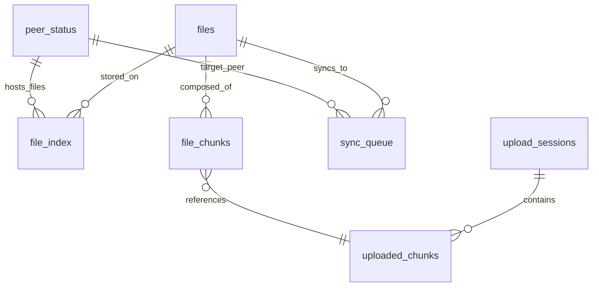

# 🗄️ Database Schema

This document describes the MeshCloud database schema, relationships, and data flow patterns.

## 📋 Overview

MeshCloud uses SQLite as its primary database for metadata storage. The schema is designed for high performance, data integrity, and efficient querying of distributed file metadata.

## 🏗️ Schema Design Principles

- **Normalized Structure**: Reduces data redundancy and improves consistency
- **Hash-Based Keys**: Content-addressable storage using SHA256 hashes
- **Temporal Tracking**: Comprehensive timestamp tracking for auditing
- **Relationship Modeling**: Clear relationships between files, chunks, and nodes
- **Scalability**: Designed for horizontal scaling with proper indexing

## 📊 Core Tables

### Files Table

Stores metadata for uploaded files.

```sql
CREATE TABLE files (
    hash TEXT PRIMARY KEY,           -- SHA256 hash of complete file
    filename TEXT NOT NULL,          -- Original filename
    size INTEGER,                    -- File size in bytes
    uploaded_at TIMESTAMP DEFAULT CURRENT_TIMESTAMP,
    chunk_count INTEGER,             -- Number of chunks
    mime_type TEXT,                  -- MIME type
    checksum TEXT                    -- Additional checksum if needed
);
```

**Indexes:**
```sql
CREATE INDEX idx_files_filename ON files(filename);
CREATE INDEX idx_files_uploaded_at ON files(uploaded_at);
CREATE INDEX idx_files_size ON files(size);
```

**Usage Patterns:**
- Primary lookup by hash for file existence checks
- Filename queries for user-facing operations
- Size-based analytics and monitoring

### File Index Table

Tracks which nodes have copies of specific files.

```sql
CREATE TABLE file_index (
    file_hash TEXT NOT NULL,
    node TEXT NOT NULL,              -- Node URL (e.g., https://node1:8000)
    replicated_at TIMESTAMP DEFAULT CURRENT_TIMESTAMP,
    status TEXT DEFAULT 'active',    -- active, pending, failed
    PRIMARY KEY (file_hash, node),
    FOREIGN KEY (file_hash) REFERENCES files(hash) ON DELETE CASCADE
);
```

**Indexes:**
```sql
CREATE INDEX idx_file_index_node ON file_index(node);
CREATE INDEX idx_file_index_status ON file_index(status);
CREATE INDEX idx_file_index_replicated_at ON file_index(replicated_at);
```

**Usage Patterns:**
- Find all nodes with a specific file
- Replication status tracking
- Geographic distribution analytics

### Upload Sessions Table

Manages multi-part upload sessions.

```sql
CREATE TABLE upload_sessions (
    upload_id TEXT PRIMARY KEY,      -- UUID for session
    filename TEXT NOT NULL,
    total_chunks INTEGER NOT NULL,
    uploaded_chunks INTEGER DEFAULT 0,
    status TEXT DEFAULT 'active',    -- active, completed, failed
    created_at TIMESTAMP DEFAULT CURRENT_TIMESTAMP,
    completed_at TIMESTAMP,
    user_id TEXT,                    -- Future: user authentication
    client_ip TEXT                   -- Client IP for auditing
);
```

**Indexes:**
```sql
CREATE INDEX idx_upload_sessions_status ON upload_sessions(status);
CREATE INDEX idx_upload_sessions_created_at ON upload_sessions(created_at);
CREATE INDEX idx_upload_sessions_user_id ON upload_sessions(user_id);
```

**Usage Patterns:**
- Session management and cleanup
- Progress tracking for large uploads
- Audit trail for upload operations

### Uploaded Chunks Table

Tracks individual chunks within upload sessions.

```sql
CREATE TABLE uploaded_chunks (
    upload_id TEXT NOT NULL,
    chunk_index INTEGER NOT NULL,
    chunk_hash TEXT NOT NULL,        -- SHA256 of chunk data
    size INTEGER NOT NULL,           -- Chunk size in bytes
    uploaded_at TIMESTAMP DEFAULT CURRENT_TIMESTAMP,
    PRIMARY KEY (upload_id, chunk_index),
    FOREIGN KEY (upload_id) REFERENCES upload_sessions(upload_id) ON DELETE CASCADE
);
```

**Indexes:**
```sql
CREATE INDEX idx_uploaded_chunks_chunk_hash ON uploaded_chunks(chunk_hash);
CREATE INDEX idx_uploaded_chunks_uploaded_at ON uploaded_chunks(uploaded_at);
```

**Usage Patterns:**
- Chunk verification during upload
- Resume capability for interrupted uploads
- Deduplication checks

### File Chunks Table

Maps files to their constituent chunks.

```sql
CREATE TABLE file_chunks (
    file_hash TEXT NOT NULL,
    chunk_hash TEXT NOT NULL,
    chunk_index INTEGER NOT NULL,    -- Position in file
    size INTEGER NOT NULL,
    created_at TIMESTAMP DEFAULT CURRENT_TIMESTAMP,
    PRIMARY KEY (file_hash, chunk_hash),
    FOREIGN KEY (file_hash) REFERENCES files(hash) ON DELETE CASCADE
);
```

**Indexes:**
```sql
CREATE INDEX idx_file_chunks_chunk_hash ON file_chunks(chunk_hash);
CREATE INDEX idx_file_chunks_chunk_index ON file_chunks(chunk_index);
```

**Usage Patterns:**
- File reconstruction from chunks
- Replication planning
- Storage optimization analysis

### Sync Queue Table

Manages file synchronization between nodes.

```sql
CREATE TABLE sync_queue (
    id INTEGER PRIMARY KEY AUTOINCREMENT,
    file_hash TEXT NOT NULL,
    peer TEXT NOT NULL,              -- Target peer URL
    priority INTEGER DEFAULT 0,      -- 0=normal, 1=high, 2=critical
    status TEXT DEFAULT 'pending',   -- pending, in_progress, completed, failed
    retry_count INTEGER DEFAULT 0,
    max_retries INTEGER DEFAULT 3,
    created_at TIMESTAMP DEFAULT CURRENT_TIMESTAMP,
    started_at TIMESTAMP,
    completed_at TIMESTAMP,
    error_message TEXT,
    bandwidth_used INTEGER           -- Bytes transferred
);
```

**Indexes:**
```sql
CREATE INDEX idx_sync_queue_status ON sync_queue(status);
CREATE INDEX idx_sync_queue_peer ON sync_queue(peer);
CREATE INDEX idx_sync_queue_priority ON sync_queue(priority);
CREATE INDEX idx_sync_queue_created_at ON sync_queue(created_at);
```

**Usage Patterns:**
- Replication job scheduling
- Failure recovery and retry logic
- Bandwidth usage monitoring

### Peer Status Table

Tracks the health and status of peer nodes.

```sql
CREATE TABLE peer_status (
    peer TEXT PRIMARY KEY,           -- Peer URL
    online BOOLEAN DEFAULT 0,
    last_seen TIMESTAMP DEFAULT CURRENT_TIMESTAMP,
    last_successful_sync TIMESTAMP,
    total_syncs INTEGER DEFAULT 0,
    failed_syncs INTEGER DEFAULT 0,
    average_response_time REAL,      -- milliseconds
    bandwidth_up INTEGER DEFAULT 0,  -- bytes uploaded
    bandwidth_down INTEGER DEFAULT 0 -- bytes downloaded
);
```

**Indexes:**
```sql
CREATE INDEX idx_peer_status_online ON peer_status(online);
CREATE INDEX idx_peer_status_last_seen ON peer_status(last_seen);
```

**Usage Patterns:**
- Peer health monitoring
- Load balancing decisions
- Network performance analytics

## 🔗 Relationships & Constraints

### Entity Relationship Diagram



### Foreign Key Constraints

```sql
-- Files to chunks
ALTER TABLE file_chunks ADD CONSTRAINT fk_file_chunks_file_hash
    FOREIGN KEY (file_hash) REFERENCES files(hash) ON DELETE CASCADE;

-- Upload sessions to chunks
ALTER TABLE uploaded_chunks ADD CONSTRAINT fk_uploaded_chunks_upload_id
    FOREIGN KEY (upload_id) REFERENCES upload_sessions(upload_id) ON DELETE CASCADE;

-- File index to files
ALTER TABLE file_index ADD CONSTRAINT fk_file_index_file_hash
    FOREIGN KEY (file_hash) REFERENCES files(hash) ON DELETE CASCADE;
```

## 🔄 Data Flow Patterns

### File Upload Flow

1. **Session Creation**
   ```sql
   INSERT INTO upload_sessions (upload_id, filename, total_chunks)
   VALUES (?, ?, ?);
   ```

2. **Chunk Upload Tracking**
   ```sql
   INSERT INTO uploaded_chunks (upload_id, chunk_index, chunk_hash, size)
   VALUES (?, ?, ?, ?);
   ```

3. **File Finalization**
   ```sql
   -- Create file record
   INSERT INTO files (hash, filename, size, chunk_count)
   VALUES (?, ?, ?, ?);

   -- Map chunks to file
   INSERT INTO file_chunks (file_hash, chunk_hash, chunk_index, size)
   VALUES (?, ?, ?, ?);

   -- Register local storage
   INSERT INTO file_index (file_hash, node)
   VALUES (?, ?);
   ```

4. **Replication Queue**
   ```sql
   INSERT INTO sync_queue (file_hash, peer, priority)
   VALUES (?, ?, ?);
   ```

### File Query Patterns

**Check File Existence:**
```sql
SELECT 1 FROM files WHERE hash = ? LIMIT 1;
```

**Find File Locations:**
```sql
SELECT node FROM file_index
WHERE file_hash = ? AND status = 'active';
```

**Get File Metadata:**
```sql
SELECT f.*, COUNT(fc.chunk_hash) as actual_chunks
FROM files f
LEFT JOIN file_chunks fc ON f.hash = fc.file_hash
WHERE f.hash = ?
GROUP BY f.hash;
```

**List Recent Uploads:**
```sql
SELECT hash, filename, size, uploaded_at
FROM files
ORDER BY uploaded_at DESC
LIMIT ?;
```

### Replication Patterns

**Get Files to Sync:**
```sql
SELECT DISTINCT f.hash, f.filename, f.size
FROM files f
LEFT JOIN file_index fi ON f.hash = fi.file_hash AND fi.node = ?
WHERE fi.file_hash IS NULL  -- Not on target peer
ORDER BY f.uploaded_at DESC;
```

**Update Sync Status:**
```sql
UPDATE sync_queue
SET status = ?, completed_at = CURRENT_TIMESTAMP, bandwidth_used = ?
WHERE id = ?;
```

**Peer Health Check:**
```sql
UPDATE peer_status
SET online = ?, last_seen = CURRENT_TIMESTAMP,
    average_response_time = ?
WHERE peer = ?;
```

## 📊 Analytics Queries

### Storage Analytics

**Total Storage Used:**
```sql
SELECT
    COUNT(*) as total_files,
    SUM(size) as total_bytes,
    AVG(size) as avg_file_size,
    MAX(size) as largest_file,
    MIN(size) as smallest_file
FROM files;
```

**Chunk Deduplication Ratio:**
```sql
SELECT
    (SELECT COUNT(*) FROM file_chunks) as total_chunk_refs,
    (SELECT COUNT(*) FROM uploaded_chunks) as unique_chunks,
    ROUND(
        (SELECT COUNT(*) FROM file_chunks) * 1.0 /
        (SELECT COUNT(*) FROM uploaded_chunks), 2
    ) as deduplication_ratio
FROM dual;
```

### Performance Analytics

**Upload Performance:**
```sql
SELECT
    COUNT(*) as total_uploads,
    AVG(JULIANDAY(completed_at) - JULIANDAY(created_at)) * 86400 as avg_upload_time,
    SUM(size) / (JULIANDAY(MAX(completed_at)) - JULIANDAY(MIN(created_at))) / 86400 as upload_rate_bps
FROM upload_sessions
WHERE status = 'completed' AND completed_at IS NOT NULL;
```

**Replication Performance:**
```sql
SELECT
    peer,
    COUNT(*) as total_syncs,
    AVG(JULIANDAY(completed_at) - JULIANDAY(created_at)) * 86400 as avg_sync_time,
    SUM(bandwidth_used) as total_bandwidth,
    AVG(bandwidth_used) as avg_bandwidth_per_sync
FROM sync_queue
WHERE status = 'completed'
GROUP BY peer
ORDER BY total_syncs DESC;
```

### Health Analytics

**Peer Reliability:**
```sql
SELECT
    peer,
    online,
    last_seen,
    total_syncs,
    failed_syncs,
    ROUND(failed_syncs * 100.0 / total_syncs, 2) as failure_rate,
    average_response_time
FROM peer_status
ORDER BY failure_rate ASC, average_response_time ASC;
```

**System Load:**
```sql
SELECT
    DATE(uploaded_at) as date,
    COUNT(*) as files_uploaded,
    SUM(size) as bytes_uploaded,
    COUNT(DISTINCT filename) as unique_filenames
FROM files
WHERE uploaded_at >= date('now', '-30 days')
GROUP BY DATE(uploaded_at)
ORDER BY date DESC;
```

## 🔧 Maintenance Operations

### Cleanup Old Sessions

```sql
-- Remove completed sessions older than 7 days
DELETE FROM upload_sessions
WHERE status = 'completed'
  AND completed_at < datetime('now', '-7 days');

-- Remove failed sessions older than 1 day
DELETE FROM upload_sessions
WHERE status = 'failed'
  AND created_at < datetime('now', '-1 day');
```

### Archive Old Sync Records

```sql
-- Move old sync records to archive table
INSERT INTO sync_queue_archive
SELECT * FROM sync_queue
WHERE completed_at < datetime('now', '-30 days');

DELETE FROM sync_queue
WHERE completed_at < datetime('now', '-30 days');
```

### Database Optimization

```sql
-- Rebuild indexes for better performance
REINDEX;

-- Analyze tables for query optimization
ANALYZE;

-- Vacuum database to reclaim space
VACUUM;
```

## 🚀 Scaling Considerations

### Read Replicas

For high-read scenarios, consider SQLite read replicas or migration to PostgreSQL/MySQL.

### Sharding Strategy

- **File Hash Sharding**: Distribute files across multiple databases
- **Geographic Sharding**: Region-based data distribution
- **Time-based Sharding**: Archive old data to separate databases

### Indexing Strategy

- **Composite Indexes**: For common query patterns
- **Partial Indexes**: For filtered queries
- **Covering Indexes**: Include all queried columns

## 🔒 Security Considerations

### Data Protection

- **Hash-based Access**: Files accessed by content hash, not sequential IDs
- **Audit Logging**: All operations timestamped and logged
- **Access Control**: Row-level security for multi-tenant scenarios

### SQL Injection Prevention

- **Parameterized Queries**: All queries use parameter binding
- **Input Validation**: Hash validation and length limits
- **Sanitization**: Filename and URL sanitization

## 📈 Monitoring Queries

### Database Health

```sql
-- Check database size
SELECT page_count * page_size as size_bytes FROM pragma_page_count(), pragma_page_size();

-- Check index usage
SELECT name, tbl_name, sql FROM sqlite_master WHERE type='index';

-- Check table sizes
SELECT name, sql FROM sqlite_master WHERE type='table';
```

### Performance Monitoring

```sql
-- Slow queries (conceptual - SQLite doesn't have slow query log)
EXPLAIN QUERY PLAN
SELECT * FROM files WHERE uploaded_at > datetime('now', '-1 hour');

-- Index effectiveness
PRAGMA index_info(idx_files_uploaded_at);
```

---

<div align="center">
  <p><strong>Database operations</strong></p>
  <a href="architecture/" class="md-button md-button--primary">Architecture Overview</a>
  <a href="api-development/" class="md-button">API Development</a>
  <a href="testing/" class="md-button">Testing Guide</a>
</div>