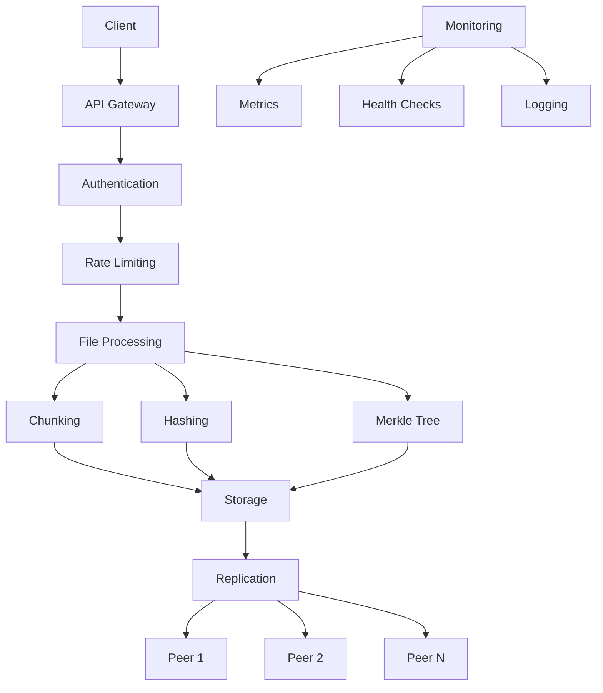

# 🏠 MeshCloud Documentation

<div align="center">
  
  
  
  
</div>

---

## 🌟 What is MeshCloud?

**MeshCloud** is a distributed, peer-to-peer file storage and synchronization system designed for modern distributed computing environments. It provides a robust, secure, and scalable solution for file sharing across multiple nodes in a mesh network.

### ✨ Key Features

- **🔄 Decentralized Architecture**: No single point of failure with peer-to-peer file distribution
- **🔒 Enterprise Security**: JWT authentication, rate limiting, and comprehensive security measures
- **📊 Real-time Monitoring**: Built-in metrics, health checks, and observability
- **⚡ High Performance**: Parallel chunked uploads with intelligent deduplication
- **🔍 Smart Deduplication**: Automatic file deduplication to save storage space
- **🌐 RESTful API**: Clean, well-documented API for easy integration
- **📈 Scalable**: Designed to handle thousands of nodes and petabytes of data

### 🚀 Quick Start

```bash
# Install MeshCloud
pip install meshcloud

# Start a node
meshcloud start --port 8000

# Upload a file
curl -X POST "http://localhost:8000/start_upload" \
  -H "Content-Type: application/json" \
  -d '{"filename": "example.txt", "total_chunks": 1}'

# Check node status
curl http://localhost:8000/
```

### 📚 Documentation Sections

<div class="grid cards" markdown>

-   :material-rocket-launch:{ .lg .middle } **Getting Started**

    ---

    New to MeshCloud? Start here to learn how to install, configure, and run your first node.

    [:octicons-arrow-right-24: Installation](getting-started/installation.md)
    [:octicons-arrow-right-24: Quick Start](getting-started/quick-start.md)
    [:octicons-arrow-right-24: Configuration](getting-started/configuration.md)

-   :material-book-open-variant:{ .lg .middle } **User Guide**

    ---

    Comprehensive guides for using MeshCloud in production environments.

    [:octicons-arrow-right-24: API Reference](user-guide/api-reference.md)
    [:octicons-arrow-right-24: File Upload](user-guide/file-upload.md)
    [:octicons-arrow-right-24: Node Management](user-guide/node-management.md)

-   :material-code-json:{ .lg .middle } **API Documentation**

    ---

    Complete API reference with examples and interactive documentation.

    [:octicons-arrow-right-24: REST API](api/rest-api.md)
    [:octicons-arrow-right-24: Authentication](api/authentication.md)
    [:octicons-arrow-right-24: Monitoring](api/monitoring.md)

-   :material-wrench:{ .lg .middle } **Developer Guide**

    ---

    Technical documentation for developers contributing to MeshCloud.

    [:octicons-arrow-right-24: Architecture](developer-guide/architecture.md)
    [:octicons-arrow-right-24: Testing](developer-guide/testing.md)
    [:octicons-arrow-right-24: Contributing](developer-guide/contributing.md)

-   :material-docker:{ .lg .middle } **Deployment**

    ---

    Production deployment guides for various environments.

    [:octicons-arrow-right-24: Docker](deployment/docker.md)
    [:octicons-arrow-right-24: Kubernetes](deployment/kubernetes.md)
    [:octicons-arrow-right-24: Production Setup](deployment/production.md)

</div>

### 🎯 Use Cases

**MeshCloud** is ideal for:

- **📁 Distributed File Storage**: Store and synchronize files across multiple geographic locations
- **🔄 Content Delivery Networks**: Build efficient CDNs with automatic replication
- **📊 Big Data Processing**: Distribute large datasets across compute clusters
- **🔧 DevOps Toolchains**: Share artifacts and build outputs across CI/CD pipelines
- **🌐 IoT Networks**: Collect and distribute data from edge devices
- **🎬 Media Distribution**: Stream and distribute large media files efficiently

### 🏗️ Architecture Overview



### 📈 Performance Characteristics

| Metric | Value | Notes |
|--------|-------|-------|
| **File Size Limit** | 100MB | Configurable per deployment |
| **Chunk Size** | 4MB | Optimized for network efficiency |
| **Concurrent Uploads** | Unlimited | Rate limited per client |
| **Replication Factor** | Configurable | Automatic load balancing |
| **Deduplication Ratio** | Up to 90% | Depends on data patterns |
| **API Response Time** | <50ms | Typical for metadata operations |

### 🔒 Security Features

- **Authentication**: JWT-based user authentication
- **Authorization**: Role-based access control
- **Encryption**: TLS 1.3 for data in transit
- **Rate Limiting**: Configurable request limits
- **Input Validation**: Comprehensive sanitization
- **Audit Logging**: Complete request/response logging

### 📊 Monitoring & Observability

- **Health Checks**: Automated system health monitoring
- **Metrics Collection**: Prometheus-compatible metrics
- **Distributed Tracing**: Request tracing across nodes
- **Log Aggregation**: Structured logging with correlation IDs
- **Alerting**: Configurable alerts for system events

### 🤝 Community & Support

- **📖 Documentation**: Comprehensive guides and API references
- **💬 Discussions**: GitHub Discussions for community support
- **🐛 Issue Tracking**: GitHub Issues for bug reports and feature requests
- **📧 Mailing List**: Stay updated with project announcements
- **💡 Contributing**: Open source project welcoming contributions

### 📄 License

MeshCloud is licensed under the **Apache License 2.0**. See the [LICENSE](about/license.md) file for details.

---

<div align="center">
  <p><strong>Ready to get started?</strong></p>
  <a href="getting-started/installation/" class="md-button md-button--primary">Install MeshCloud</a>
  <a href="https://github.com/yourusername/meshcloud" class="md-button">View on GitHub</a>
</div>